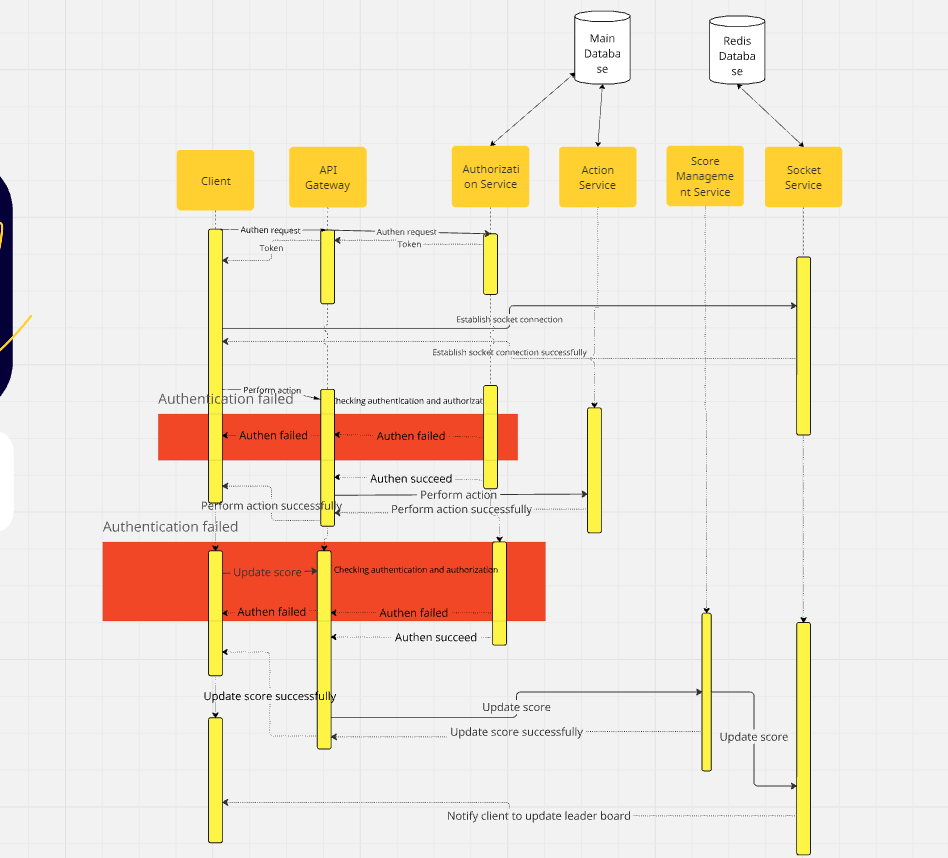

# Specification Document Structure

## Introduction

- Purpose: Live updating the score board

## System overview

### Architecture Overview

1. API Gateway
2. Services
   - Authentication service
   - Score management service
   - Action service
   - Socket service
3. Database
4. Message queue

### Components Descriptions

1. API Gateway

   - Responsibilities: Route API requests to appropriate backend services, and handle authentication and authorization.
   - Technology Stack: Nginx, AWS API Gateway

2. Services

   - Authentication service
     - Responsibilities: Authenticate users
     - Technology Stack: NodeJS
   - Score management service
     - Responsibilities: Validate and process score updates, and interact with the database.
     - Technology Stack: NodeJS
   - Action service
     - Responsibilities: Management action of the user to get scores
     - Technology Stack: NodeJS
   - Socket service
     - Responsibilities: Push real-time score updates to the clients.
     - Technology Stack: Node.js with SocketIO

3. Database

   - Responsibilities: Store user information, actions and scores
   - Technology Stack: PostgresSQL, MongoDB,..

4. Message Queue
   - Responsibilities: Handle action requests of the user
   - Technology Stack: RabbitMQ, Kafka, AWS SQS, etc.

### Execution flow

1. Client sends an authentication request and receives the token
2. Client uses the token to establish a socket connection with a socket server
3. Client acts to receive scores
4. Server receives the action request, stores the data in the database and returns a successful response to the client
5. Client receives the response and calls updating score API
6. Store management service updates the score and sends the message to socket server
7. Socket server receives the message and emits event to the client for updating the leaderboard

### Diagram

